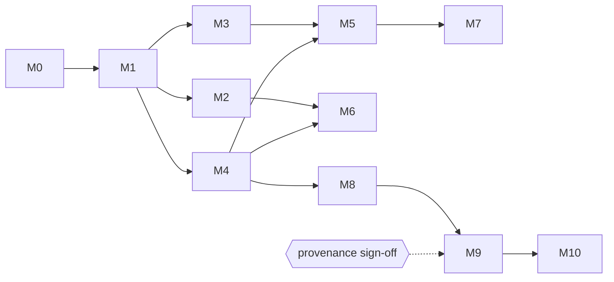

# koni_archive — Roadmap

Tracking document. **`PROMPT_V1.md` is the source of truth for requirements**;
section references below point into it. Update the Status column as work lands —
scope changes belong in `PROMPT_V1.md`, not here.

Last updated: 2026-07-15 · Statuses: ⬜ not started · 🟨 in progress · ✅ done

---

## Phase 1 — Reading

| #   | Milestone            | Scope (summary)                                                                  | Exit criterion                                        | Status |
| --- | -------------------- | -------------------------------------------------------------------------------- | ----------------------------------------------------- | ------ |
| M0  | Scaffolding          | Pub workspace, package skeletons, lints, CI (VM ×3 OS + dart2js + dart2wasm), fixture generator, MIT licenses, conformance-runner skeleton | CI green on all platforms with empty packages         | ✅     |
| M1  | Core                 | `ByteSource` (+ memory/file/blob impls), byte/bit readers, CRC32/Adler32, exceptions, entry model, path normalization, detection registry | Core API dartdoc'd; registry drives detection e2e     | ✅     |
| M2  | TAR                  | ustar + PAX + GNU long names, base-256, all entry types represented               | Real-world tarballs (incl. CBT) list & stream          | ✅     |
| M3  | ZIP (stored)         | EOCD scan, central directory, implicit dirs, encodings, ZIP64-detect→error        | Stored-only ZIPs list & stream                         | ✅     |
| M4  | Inflate + GZIP       | Inflate codec (vector-tested standalone), gzip framing incl. multi-member, `.gz` single-entry adapter | Codec passes canonical vectors; `.gz` opens as archive | ✅     |
| M5  | ZIP (deflate)        | Wire inflate into M3                                                              | **CBZ works end-to-end → tag 0.1.0** (6 packages)      | ✅     |
| M6  | tar.gz               | Layered detection, documented random-access strategy (sequential + cache)         | `.tar.gz`/`.tgz` opens as the inner TAR                | ✅     |
| M7  | ZIP hardening        | ZIP64, data-descriptor edge cases, encoding hook, encrypted-entry detection polish | ZIP64 fixtures pass; mojibake fixtures decode via hook | ✅     |
| M8  | 7z                   | Container + LZMA → LZMA2 → BCJ(x86) → delta; solid-block LRU cache; BCJ2/PPMd/AES→typed errors | CB7 page-flip usable (bench recorded)                  | ✅     |
| M9  | RAR5                 | ✅ Gate passed: provenance signed off 2026-07-15. Container + RAR5 codec           | CBR (v5) works                                         | ✅     |
| M10 | RAR4                 | Container + store + method-29 (v29 LZSS/Huffman); PPMd/RarVM/solid→typed errors    | CBR (v4) works — flagship use case complete            | ✅     |

Every milestone additionally carries the standing definition of done
(`PROMPT_V1.md` §13.2): all CI platforms green incl. dart2wasm, fixtures passing,
fuzz smoke clean, dartdoc complete, CHANGELOG entry, benchmarks recorded on hot
paths.

### Dependencies

M2/M3/M4 are independent after M1 (fixed order above, but slippage in one does not
block the others). M8's LZMA work has no dependency on ZIP milestones — only on
the codec infrastructure from M4's standalone-codec pattern.

### Release points

* **0.1.0** at M5 — facade, core, codecs, tar, zip, gzip (CBZ/CBT support).
* **0.2.0** at M8 — sevenz (CB7 support).
* **0.3.0** at M10 — rar (CBR support). **Phase 1 complete (2026-07-15).**
* **0.4.0** at P2-4b — writing: TAR, ZIP, and 7z with the pure-Dart
  LZMA/LZMA2 encoder (CBT/CBZ/CB7 authoring). **Phase 2 write milestones
  complete (2026-07-15).** Git-only, not published to pub.dev.
* All packages stay 0.x with lockstep minor bumps until the API stabilizes.

---

## Phase 2 — Writing (unscheduled, scope in `PROMPT_V1.md` §15/§16)

| #   | Milestone   | Scope (summary)                                   | Status |
| --- | ----------- | ------------------------------------------------- | ------ |
| P2-1 | Write API  | Format-agnostic `ArchiveWriter` abstraction       | ✅     |
| P2-2 | TAR write  | ustar + PAX emission, streaming input             | ✅     |
| P2-3 | ZIP write  | Stored + deflate compression, ZIP64               | ✅     |
| P2-4a | 7z write: container | Full write container + Copy/Deflate, no new codec | ✅     |
| P2-4b | 7z write: LZMA      | LZMA/LZMA2 encoder (range coder + match finder)   | ✅     |

Scope agreed in `koni_sevenz/doc/writing-scope.md` (commit to the LZMA path;
4a de-risks the container, 4b is the load-bearing encoder). RAR writing is
permanently out of scope.

---

## Phase 3 — Encryption/password support, read side (scope in `doc/encryption-scope.md`)

| #    | Milestone            | Scope (summary)                                                    | Status |
| ---- | -------------------- | ------------------------------------------------------------------ | ------ |
| P3-1 | Crypto primitives    | AES, CBC/CTR, SHA-1, SHA-256, HMAC, PBKDF2 in koni_codecs; vector-tested on VM + dart2js + dart2wasm | ⬜     |
| P3-2 | ZIP decryption       | zipcrypto + WinZip AE-1/AE-2; `password` read option + `InvalidPasswordException` in core | ⬜     |
| P3-3 | 7z decryption        | AES-256 coder in the folder chain (buffer-per-coder refactor) + encrypted headers | ⬜     |
| P3-4 | RAR5 decryption      | File-data decryption (`-p`), PBKDF2 keys, check value, tweaked CRCs; `-hp` headers deferred (typed error, layout documented) | ⬜     |
| P3-5 | RAR4 decryption      | Salted file data (iterated-SHA-1 KDF, AES-128); encrypted headers stay deferred | ⬜     |

Release point: **0.5.0** at P3-5 (lockstep, git-only). Write-side encryption
and ZIP strong-encryption (SES) stay deferred — see the scope doc.

---

## Deferred backlog (typed errors today; candidates for post-Phase-1)

From `PROMPT_V1.md` §15 — roughly in expected demand order:

* ~~Encryption/password support (ZIP AES/zipcrypto, 7z AES, RAR)~~ → **Phase 3 above**
* Write-side encryption (ZIP AES, 7z AES) — after Phase 3 proves the read side
* Sequential (non-seekable) input for TAR/gzip
* HTTP-range `ByteSource` package (remote CBZ page reads)
* gzip seek-index (zran-style) for random access into `.tar.gz`
* 7z BCJ2, PPMd
* GNU sparse tars
* Multi-volume archives
* New formats via the registry: XZ, BZip2/tar.bz2, CPIO, ISO, CAB, …
