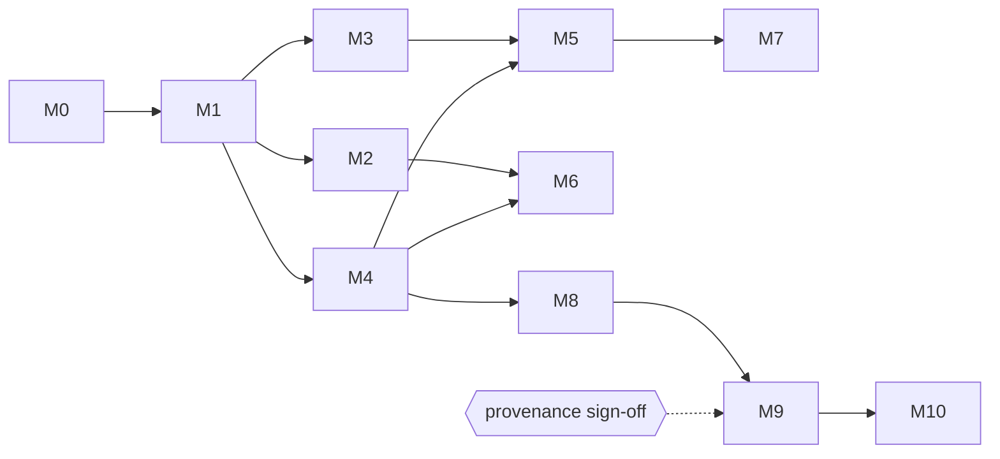

# koni_archive — Roadmap

Tracking document for the milestones behind each release. Update the Status
column as work lands. (Older `§N` references in code comments point at the
original design spec, kept as section breadcrumbs.)

Last updated: 2026-07-16 · Statuses: ⬜ not started · 🟨 in progress · ✅ done

---

## Phase 1 — Reading

| #   | Milestone            | Scope (summary)                                                                  | Exit criterion                                        | Status |
| --- | -------------------- | -------------------------------------------------------------------------------- | ----------------------------------------------------- | ------ |
| M0  | Scaffolding          | Pub workspace, package skeletons, lints, CI (VM ×3 OS + dart2js + dart2wasm), fixture generator, MIT licenses, conformance-runner skeleton | CI green on all platforms with empty packages         | ✅     |
| M1  | Core                 | `ByteSource` (+ memory/file/blob impls), byte/bit readers, CRC32/Adler32, exceptions, entry model, path normalization, detection registry | Core API dartdoc'd; registry drives detection e2e     | ✅     |
| M2  | TAR                  | ustar + PAX + GNU long names, base-256, all entry types represented               | Real-world tarballs (incl. CBT) list & stream          | ✅     |
| M3  | ZIP (stored)         | EOCD scan, central directory, implicit dirs, encodings, ZIP64-detect→error        | Stored-only ZIPs list & stream                         | ✅     |
| M4  | Inflate + GZIP       | Inflate codec (vector-tested standalone), gzip framing incl. multi-member, `.gz` single-entry adapter | Codec passes canonical vectors; `.gz` opens as archive | ✅     |
| M5  | ZIP (deflate)        | Wire inflate into M3                                                              | **CBZ works end-to-end → tag 0.1.0** (6 packages)      | ✅     |
| M6  | tar.gz               | Layered detection, documented random-access strategy (sequential + cache)         | `.tar.gz`/`.tgz` opens as the inner TAR                | ✅     |
| M7  | ZIP hardening        | ZIP64, data-descriptor edge cases, encoding hook, encrypted-entry detection polish | ZIP64 fixtures pass; mojibake fixtures decode via hook | ✅     |
| M8  | 7z                   | Container + LZMA → LZMA2 → BCJ(x86) → delta; solid-block LRU cache; BCJ2/PPMd/AES→typed errors | CB7 page-flip usable (bench recorded)                  | ✅     |
| M9  | RAR5                 | ✅ Gate passed: provenance signed off 2026-07-15. Container + RAR5 codec           | CBR (v5) works                                         | ✅     |
| M10 | RAR4                 | Container + store + method-29 (v29 LZSS/Huffman) + RarVM standard filters (delta/E8/RGB/audio); PPMd/custom-VM/solid→typed errors | CBR (v4) works — flagship use case complete            | ✅     |

Every milestone additionally carries the standing definition of done
(§13.2): all CI platforms green incl. dart2wasm, fixtures passing,
fuzz smoke clean, dartdoc complete, CHANGELOG entry, benchmarks recorded on hot
paths.

### Dependencies

M2/M3/M4 are independent after M1 (fixed order above, but slippage in one does not
block the others). M8's LZMA work has no dependency on ZIP milestones — only on
the codec infrastructure from M4's standalone-codec pattern.

### Release points

* **0.1.0** at M5 — facade, core, codecs, tar, zip, gzip (CBZ/CBT support).
* **0.2.0** at M8 — sevenz (CB7 support).
* **0.3.0** at M10 — rar (CBR support). **Phase 1 complete (2026-07-15).**
* **0.4.0** at P2-4b — writing: TAR, ZIP, and 7z with the pure-Dart
  LZMA/LZMA2 encoder (CBT/CBZ/CB7 authoring). **Phase 2 write milestones
  complete (2026-07-15).** Git-only, not published to pub.dev.
* **0.5.0** at P3-5 — reading password-protected archives across all
  formats (ZIP zipcrypto/AES, 7z AES, RAR5/RAR4 file encryption). **Phase 3
  complete (2026-07-15).** Git-only.
* **0.6.0** — write-side encryption (Phase 4: ZIP WinZip AES-256, 7z AES-256
  + `-mhe`), the 7z-reader `isEncrypted` fix, and the new `koni_http_source`
  package (remote reads over HTTP Range). **First release published to
  pub.dev (2026-07-15).**
* All packages stay 0.x with lockstep minor bumps until the API stabilizes.

---

## Phase 2 — Writing (§15/§16)

| #   | Milestone   | Scope (summary)                                   | Status |
| --- | ----------- | ------------------------------------------------- | ------ |
| P2-1 | Write API  | Format-agnostic `ArchiveWriter` abstraction       | ✅     |
| P2-2 | TAR write  | ustar + PAX emission, streaming input             | ✅     |
| P2-3 | ZIP write  | Stored + deflate compression, ZIP64               | ✅     |
| P2-4a | 7z write: container | Full write container + Copy/Deflate, no new codec | ✅     |
| P2-4b | 7z write: LZMA      | LZMA/LZMA2 encoder (range coder + match finder)   | ✅     |

Scope agreed in `koni_sevenz/doc/writing-scope.md` (commit to the LZMA path;
4a de-risks the container, 4b is the load-bearing encoder). RAR writing is
permanently out of scope.

---

## Phase 3 — Encryption/password support, read side (scope in `doc/encryption-scope.md`)

| #    | Milestone            | Scope (summary)                                                    | Status |
| ---- | -------------------- | ------------------------------------------------------------------ | ------ |
| P3-1 | Crypto primitives    | AES, CBC/CTR, SHA-1, SHA-256, HMAC, PBKDF2 in koni_codecs; vector-tested on VM + dart2js + dart2wasm | ✅     |
| P3-2 | ZIP decryption       | zipcrypto + WinZip AE-1/AE-2; `password` read option + `InvalidPasswordException` in core | ✅     |
| P3-3 | 7z decryption        | AES-256 coder peeled ahead of the folder chain + encrypted headers (`-mhe`) | ✅     |
| P3-4 | RAR5 decryption      | File-data decryption (`-p`), PBKDF2 keys, check value, tweaked CRCs; `-hp` headers deferred (typed error, layout documented) | ✅     |
| P3-5 | RAR4 decryption      | Salted file data (iterated-SHA-1 KDF, AES-128), store + compressed; fixtures via rar 6.24; encrypted headers stay deferred | ✅     |

Release point: **0.5.0** at P3-5 (lockstep, git-only) — **Phase 3 complete
(2026-07-15).** ZIP strong-encryption (SES) stays deferred — see the scope
doc.

---

## Phase 4 — Encryption/password support, write side (scope in `doc/encryption-scope.md`)

| #    | Milestone       | Scope (summary)                                                  | Status |
| ---- | --------------- | ---------------------------------------------------------------- | ------ |
| P4-1 | ZIP encryption  | WinZip AES-256 (AE-2, method 99): per-entry salt, PBKDF2-HMAC-SHA1 keys, AES-CTR + HMAC-SHA1 tag, CRC zeroed | ✅     |
| P4-2 | 7z encryption   | AES-256-CBC file data: `compressor → AES` folder chain, iterated-SHA-256 KDF, per-folder IV; **plus `-mhe` encrypted headers** via `encryptHeader` | ✅     |

`ArchiveWriteOptions.password` (whole-archive, AES-256) drives both; add
`encryptHeader` for 7z `-mhe` (hides entry names). TAR rejects any password
(no standard encryption). Verified by self round-trip on VM + dart2js +
dart2wasm and by `7zz x -p` decrypting our output byte-for-byte (incl. `7zz
l -p` listing a hidden-header archive). Deferred: ZIP traditional zipcrypto
(write), ZIP AES-128/192 (write) — see the scope doc.

---

## RAR completeness (post-0.6.0, depth-first)

Owner directive after the 0.6.0 pub.dev launch: make each already-shipped
format *excellent* before adding new formats — RAR first. Full RAR *reading*
support is the goal (RAR writing stays permanently out of scope, §15). Agreed
order of attack:

| # | Item | Status |
| --- | --- | ------ |
| R1 | RAR4 RarVM **standard filters** (delta, x86 E8/E9, RGB, audio) — unblocks 37 delta-filtered pages in the corpus | ✅ (byte-exact vs rar 6.24 on VM/dart2js/dart2wasm; conformance now 0 deferrals) |
| R2 | RAR5 `-hp` encrypted-header **read** | ✅ (per-block IV + block-key CBC headers; byte-exact vs rar 7.x on VM/dart2js/dart2wasm; wrong/no-password typed errors) |
| R3 | Solid RAR4 | ✅ (persistent tables/offset-cache/window across the run; byte-exact vs unrar on VM/dart2js/dart2wasm; fuzz-hardened) |
| R4 | Multi-volume (RAR4 + RAR5) | ✅ (`ArchiveReadOptions.nextVolume` resolver; split files reassembled across volumes; store + compressed, both versions, byte-exact vs unrar on VM/dart2js/dart2wasm) |
| R5 | RAR4 PPMd (variant H) — the finale; large, no corpus coverage | ✅ (public-domain Ppmd7 model + RAR range decoder; byte-exact vs unrar/CRC from 82 B to 2.6 MB, order 2–63, mem 1–8 MB, non-solid **and solid**, on VM/dart2js/dart2wasm; fuzz-hardened. Only a mid-file PPMd→method-29 switch stays a typed error — see R8) |
| R6 | Custom (non-standard) RAR4 **RarVM** filter programs — a generic bytecode interpreter | ⬜ (unblocked: the BSD Go `rardecode` `vm.go` is a clean-room reference, so no longer license-bounded) |
| R7 | RAR4 **`-hp` encrypted headers** (read) | ⬜ (RAR3/4 header crypto; `rardecode` supports it — reference available) |
| R8 | Mid-file **PPMd→method-29 (LZSS) block switch** (escape code 0) | ⬜ (the last PPMd gap; `rardecode`'s unified decode loop shows the range-decoder→Huffman hand-off) |
| R9 | **RAR 1.5 / 2.0** legacy unpack methods (v15/v20, incl. RAR2 multimedia/audio) | ✅ for **RAR 2.0 (v20) LZ**: byte-exact vs `unrar` on VM/dart2js/dart2wasm, fuzz-hardened; fixtures authored with DOS RAR 2.50 under DOSBox. v26 shares the v20 decoder but is untested (no fixture). Typed errors (no permissive reference — only GPL unrar): **v15** (RAR 1.5; `rardecode` returns `ErrUnsupportedDecoder`), the **multimedia/audio** block (`rardecode`'s decoder mis-decodes it vs `unrar`), and **solid v20 continuations** (run start still decodes; full solid-v20 decode deferred) |

The BSD Go `rardecode` reader (established as a clean-room reference in R5 —
it, unlike libarchive, implements the whole RAR family) reopens the RAR
completeness track. It **lifts the license boundary** that had deferred the
generic RarVM interpreter (R6) and RAR4 `-hp` headers (R7): those were held back
because the only prior interpreter/`-hp` reference was the GPL unrar, and
`rardecode` is BSD-2-Clause. R8 (mid-file PPMd↔LZSS switch) and R9 (legacy
methods) are now reference-backed too. Suggested order by effort/value: R7
(cheap, contained), R6 (highest impact, largest — a full VM), R9 (breadth), R8
(niche). Separately, `rardecode` is a second *independent* implementation (not
just the `unrar` black-box binary) — worth a source-level cross-read to
re-verify the fiddly already-shipped paths (RAR5 filter math, the method-29
offset cache, the encryption KDFs) if a bug ever surfaces. RAR *writing* stays
permanently out of scope (§15).

### R5 — remaining typed error (folded into R8)

The one RAR4 PPMd hole is a *mid-file* PPMd→method-29 (LZSS) block switch
(escape code 0 selecting an LZSS block); wiring the PPMd↔LZSS loop hand-off is
unimplemented, so it stays a typed error (rare — needs `-mct` auto-mode over
alternating text/non-text content). A code-0 to another PPMd block is handled.

### R5 — RAR4 PPMd (variant H): done (2026-07-16)

PPMd variant H (Dmitry Shkarin's PPMII, RAR's `-mct` "text compression") now
decodes. `rar4_ppmd.dart` ports the **public-domain** Ppmd7 codec (Igor Pavlov,
via libarchive's `archive_ppmd7.c`) — a range decoder, an order-N context model
with SEE, a suffix-linked context tree, and a unit sub-allocator — with RAR's
range-decoder variant and escape-char dispatch adapted from libarchive's BSD
`rar.c`. Full detail in `koni_rar/doc/notes.md` ("RAR4 PPMd"); provenance in
`doc/references.md` + `NOTICE`.

* **Verified:** byte-exact vs `unrar`/CRC-32 from 82 B to 2.6 MB, order 2–63,
  memory 1–8 MB, non-solid and solid, on VM + dart2js + dart2wasm
  (`test/rar4_ppmd_web_test.dart`); fuzz-hardened (corrupt input → typed errors
  only, 100k+ iterations). Fixtures authored with **rar 6.24** live in
  `test/fixtures/rar_static/ppmd_rar4*.rar` and `solid_ppmd.rar` (the manga
  corpus never triggers PPMd, so these are the only oracle). This decoder even
  handles a stream libarchive 3.7.4 itself fails.
* **Solid PPMd** was closed after web research surfaced the BSD Go `rardecode`
  reader, which handles solid RAR (libarchive does not): each solid file is a
  PPMd block ending with an escape-code-2 marker, and the shared model + escape
  symbol carry across files (the escape resets only on flag 0x40). Verified on
  2–5-file runs incl. a 1-byte and 2×730 KB members.
* **Remaining typed error:** a *mid-file* PPMd→method-29 (LZSS) block switch
  (escape code 0 → an LZSS block); the PPMd↔LZSS loop hand-off is unimplemented.
  A code-0 to another PPMd block is handled. Rare — needs `-mct` auto-mode over
  alternating text/non-text content.

### R6 — Custom (non-standard) RAR4 RarVM filter programs: starting notes

Today `rar4_filters.dart` recognizes only the four **standard** RarVM programs
(delta, x86 E8/E9, RGB, audio) by fingerprint and runs hand-written
implementations; any other filter program is a typed error. R6 replaces that
with a **generic RarVM interpreter** so *any* method-29 filter decodes.

* **What it is:** RAR3/4's filters are little bytecode programs for a pseudo-x86
  VM (8 registers, a 256 KB address space, ~40 opcodes: mov/cmp/add/sub/xor/
  mul/div, shifts, conditional jumps, call/ret, push/pop/pusha/popa, movzx/
  movsx). A file's `read_filter` record carries a compiled program; the decoder
  runs it over each filtered output region. Standard filters are just the
  common programs — a generic interpreter subsumes the fingerprint dispatch.
* **Provenance (the unblock):** deferred until now **by license** — the only
  interpreter reference was the GPL unrar. The BSD Go `rardecode` `vm.go` is a
  clean-room generic RarVM interpreter (BSD-2-Clause), so R6 is now
  license-clear (adapt structure; keep the BSD notice in `NOTICE`, attribution
  in `references.md`). Update the stale "by license" wording in
  `references.md`/`notes.md`/`rar-provenance.md` when this lands.
* **Fixtures / oracle:** author RAR4 archives whose data trips a *non-standard*
  program (harder than the standard filters — needs input the compressor
  filters with a bespoke program; may require crafted content or specific `-mc`
  modes) with rar 6.24, verify byte-exact vs `unrar`. Keep the standard-filter
  fingerprints as a fast path or drop them once the VM is byte-exact on the
  existing `filter_*.rar` fixtures. dart2js/dart2wasm 32-bit traps apply.
* **Scope note:** the *standard*-filter fast path already covers what the manga
  corpus emits; R6 is a completeness play for archives from other tools.

### R7 — RAR4 `-hp` encrypted headers (read): starting notes

RAR4 file-data decryption (`-p`, P3-5) already works; `-hp` (encrypted *headers*)
is still a typed error. R7 reads it with a password.

* **What it is:** with `-hp`, the block headers themselves are AES-encrypted
  (the same RAR3 SHA-1 KDF + AES-128-CBC as file data, salted). The reader must
  detect the encrypted-header archive, derive the key from the password, and
  decrypt each header before parsing — mirroring the RAR5 `-hp` path (R2) but
  with RAR3 crypto (already implemented in `rar_crypto.dart`).
* **Provenance:** `rardecode` supports RAR3/4 `-hp` (BSD reference); the RAR5
  `-hp` reader (R2) is the structural analogue on our side. Contained scope.
* **Fixtures:** `rar a -ma4 -hpsecret …` with rar 6.24; wrong/missing-password
  cases must stay typed errors (RAR4 has no password check value, so a wrong
  password surfaces as a checksum/parse error — same policy as P3-5).

### R8 — Mid-file PPMd→method-29 (LZSS) block switch: starting notes

The last PPMd gap (see R5). Escape code 0 inside a PPMd block can select a
*method-29 (LZSS)* block mid-file; our decode loops are per-method, so the
PPMd→LZSS hand-off throws `UnsupportedFeatureException`. (Code 0 → another PPMd
block already works.)

* **The hard part:** after the range decoder's read-ahead, the method-29
  Huffman bit-reader must resume from the right stream position. `rardecode`'s
  unified `fill()`/`readBlockHeader()` loop (one shared bit-reader, decoders
  swapped per block) shows the structure; adopting it here means unifying the
  PPMd and method-29 decode loops rather than calling them separately.
* **Fixtures:** the uncommitted `-mct` auto-mode fixtures from R5 bring-up
  (text+binary that alternates) trigger it; commit a small one. Rare in the wild.

### R9 — RAR 1.5 / 2.0 legacy unpack methods

koni_rar decodes method-29 (unpack v29, RAR 2.9/3.x) — the format essentially
every modern `.rar` uses. Older archives declare unpack version 15 (RAR 1.5),
20 (RAR 2.0), or 26 (RAR 2.6), which use different LZ/Huffman schemes and, for
v20/v26, a multimedia/audio filter. R9 adds **v20/v26 LZ** decoding
(done 2026-07-16).

* **Container:** the v1.5 container was already parsed but discarded the
  unpack-version byte and hardcoded v29; it now preserves it
  (`Rar5FileHeader.unpackVersion`, distinct from the `version` family marker so
  RAR4/RAR5 decoder dispatch is untouched).
* **Decoder:** `rar20_decoder.dart` (`Rar20Decoder`) — v20/v26 LZSS with the
  main/offset/length Huffman tables, adapted from the BSD `rardecode`
  (`decode20.go`/`decode20_lz.go`). The bit-reader and canonical Huffman decoder
  were factored into a shared `rar_bits.dart` (`Bits`/`Huffman`) reused by the
  method-29 and v20 decoders; the LZ base tables are the standard RAR tables.
* **Fixtures — the unblock:** no tool on the build machine authors v20 (rar ≥3
  writes v29; rar 2.x is 32-bit i386 that Rosetta 2 can't run), and no permissive
  test corpus exists. Solved by running **DOS RAR 2.50** (rarlab `rar250.exe`,
  extracted with `unrar`) under **DOSBox** (`brew install dosbox`, headless via
  `SDL_VIDEODRIVER=dummy`); `unrar` is the byte-exact oracle. Verified byte-exact
  on VM + dart2js + dart2wasm (`test/rar2_web_test.dart`,
  `rar_static/rar2_*.rar`); fuzz-hardened.
* **v26 (RAR 2.6):** routes to the same decoder (`rardecode` maps `case 20, 26`
  together) but is **untested** — DOS RAR 2.50 authors only v20, so there is no
  v26 fixture to verify against.
* **Typed errors (reference-bounded):** the **multimedia/audio** block —
  `rardecode`'s audio predictor mis-decodes it (verified: rardecode itself fails
  the audio fixture's CRC vs `unrar`), so no correct permissive reference exists;
  **v15 (RAR 1.5)** — `rardecode` returns `ErrUnsupportedDecoder`, libarchive is
  v29-only (only the GPL unrar has either); and **solid v20 continuations** — a
  solid run's first file decodes via the non-solid path, but continuations would
  misroute to the method-29 solid path, so they are rejected cleanly (full
  solid-v20 decode deferred: doubly rare). Store (method 0) is version-agnostic
  and decodes at any version.
* **Value:** breadth — vintage `.rar` files. Rare in practice (the manga corpus
  and any modern archive are v29/v50).

## Deferred backlog (typed errors today; candidates for post-Phase-1)

Roughly in expected demand order:

* ~~Encryption/password support (ZIP AES/zipcrypto, 7z AES, RAR)~~ → **Phase 3 above**
* ~~Write-side encryption (ZIP AES, 7z AES)~~ → **Phase 4 above**
* ~~7z reader: set `entry.isEncrypted` on parse~~ → done (matches the ZIP
  reader; the entry's folder-has-AES flag)
* Sequential (non-seekable) input for TAR/gzip
* ~~HTTP-range `ByteSource` package (remote CBZ page reads)~~ → done
  (`koni_http_source`: `HttpRangeByteSource`, `package:http` + injectable
  fetcher seam, `If-Range` guard; verified against a real `dart:io`
  `HttpServer`)
* gzip seek-index (zran-style) for random access into `.tar.gz`
* 7z BCJ2, PPMd
* GNU sparse tars
* Multi-volume archives — **done for RAR** (R4 above, via `nextVolume`); 7z/ZIP spanning still deferred
* New formats via the registry: XZ, BZip2/tar.bz2, CPIO, ISO, CAB, …
